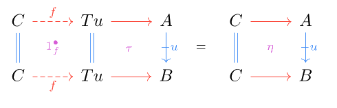
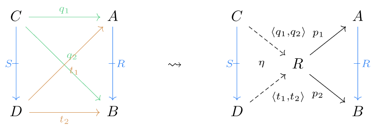

# Double Limits: A User’s Guide

Guest post by [Matt Kukla](https://mkukla.net) and Tanjona Ralaivaosaona

Double limits capture the notion of limits in double categories. In
ordinary category theory, a limit is the best way to construct new
objects from a given collection of objects related in a certain way.
Double limits, extend this idea to the richer structure of double
categories. For each of the limits we can think of in an ordinary
category, we can ask ourselves: how do these limits look in double
categories?

In ordinary category theory, many results can be extended to double
categories. For instance, in an ordinary category, we can determine if
it has all limits (resp. finite limits) by checking if it has all
products and equalizers (resp. binary products, a terminal object, and
equalizers) (see Thm 5.1.26 in [3]). In a double category, we need to
introduce a new notion of limit, known as a tabulator. One of the main
theorems by Grandis and Paré states that a double category has all small
double limits if and only if it has small double products, double
equalizers, and tabulators. Therefore, these components are sufficient
to construct small double limits. To explain this concept thoroughly, we
will introduce their definitions in this post. There are various
definitions depending on your focus, but for the sake of simplicity,
this guide aims to be accessible to anyone with a background in category
theory. For an introduction to double categories, see [here](https://ncatlab.org/nlab/show/double+category).

We give an overview of how limits behave in this two-dimensional
setting, following Grandis and Paré's "Limits in double categories." In
particular, we make several definitions more explicit for use in further
computations.

# Introduction

Recall that double categories consist of two types of morphisms,
horizontal and vertical, which interact in a compatible way. Often,
composition of one arrow type is weaker than the other. Therefore, we
may also think of limits in two different directions. However, limits
with respect to the weaker class of morphisms tend to be badly behaved.
Hence, in this post, we will only focus on horizontal double limits.

Throughout this article, we will refer to the class of morphisms with
strong composition as "arrows," written horizontally, with composition
denoted by $\circ$. The weaker arrows will be called "proarrows,"
written as vertical dashed arrows, and with composition denoted by
$\bullet$. Identity arrows/proarrows for an object $X$ will be written
$\mathbf{1}_X$ and $\mathbf{1}_X^\bullet$ respectively. Sometimes, we
will also refer to the identity *cell* associated to an arrow
$f:X \to Y$. This is obtained by taking both proarrow edges to be the
respective vertical identities on objects:

There's an analogous construction for proarrows, but we won't need it in
this article.

Double limits are defined for double diagrams and a double diagram is a
double functor from an indexing double category $\mathbb{I}$ to an
arbitrary double category $\mathbb{A}$. A limit for a given double
diagram $D$ is a universal double cone over $D$. This is a very
high-level definition, but we will try to explain each unfamiliar term
and illustrate it with examples.

The first thing we need to understand is a double diagram for which we
take the limits.

# Diagrams

A double diagram in $\mathbb{A}$ of shape $\mathbb{I}$ is a double
functor $F: \mathbb{I}\to \mathbb{A}$ between double categories
$\mathbb{I}$ and $\mathbb{A}$.  In strict double categories, a double
functor is simultaneously a functor on the horizontal and vertical
structures, preserving cells as well as their vertical compositions,
horizontal compositions, identities. That is, for every cell
$\alpha: u\to v$,

and for every composable pair of cells $\alpha: u\to v$ and $\beta: v\to w$

1.  preserve horizontal compositions of cells:
    $F (\beta \circ \alpha) = F(\beta) \circ F(\alpha)$,

2.  preserve vertical compositions of cells:
    $F (\gamma \bullet \alpha) = F(\gamma) \bullet F(\alpha)$,

3.  preserve cell-wise horizontal identity: for each proarrow
    $u: A\nrightarrow B$, $F(1_u) = 1_{F u}$,

4.  preserve cell-wise vertical identity: for each arrow $f: A\to A'$,\
    $F(1^{\bullet}_f) = 1^{\bullet}_{F f}$,

We will also need the notion of a double natural transformation. These
are defined componentwise, much in the same way as ordinary natural
transformations. For double functors $F, G: \mathbb{I} \to \mathbb{A}$,
a horizontal transformation $H: F \Rightarrow G$ is given by the
following data:

-   horizontal $\mathbb{A}$-arrows $Hi: Fi \to Gi$ for every object
    $i \in \mathbb{I}$

-   an $\mathbb{A}$-cell $Hu$ for every proarrow $u:i \nrightarrow j$ in
    $\mathbb{I}$ of the shape 
    
    ![[3.png]]
-   Identities and composition are preserved.

-   For every cell $\alpha \in \mathbb{I}$ with proarrow edges $u, v$
    and arrow edges $f, g$, the component cells of $u$ and $v$ satisfy
    $(F\alpha | Hv) = (Hu|G\alpha)$

Vertical transformations satisfy analogous requirements with respect to
vertical morphisms, given Section 1.4 of [1].

We will also use the notion of a modification to define double limits.
Suppose we have double functors
$F, F', G, G': \mathbb{I} \to \mathbb{A}$, horizontal transformations
$H:F \Rightarrow G, K: F' \Rightarrow G'$ and vertical transformations
$U:F \Rightarrow F', V: G \Rightarrow G'$. A modification is an
assignment of an $\mathbb{A}$-cell $\mu i$ to each object
$i \in \mathbb{I}$:

such that, for every horizontal $f:i \to j$, $(\mu i| Vf) = (Uf|\mu j)$:

Double limits will be defined as a universal double cone. But what are
cones or double cones in double categories? You may ask.

Like ordinary categories, cones for a functor $F$ in double categories
also consist of an object $X$ and morphisms from $X$ to the objects
$Fi$, for each object $i$ of $\mathbb{I}$. Note that there two types of
morphisms, those of horizontal direction or arrows and those of vertical
direction or proarrows. The morphisms involved in cones are the
horizontal ones but must be compatible with vertical ones. Let's dive
into the definition to see how that works.

A double cone for a double functor $F: \mathbb{I}\to \mathbb{A}$
consists of an $X$ with arrows $pi: X\to Fi$ for each object $i$ of
$\mathbb{I}$, and cells $pu: \mathbf{1}^{\bullet}_X \to Fu$ for each
every proarrow $u:i\nrightarrow j$, satisfying the following axioms:

1.  for each object $i$ in $\mathbb{I}$,
    $$p(\mathbf{1}^{\bullet}_i)= \mathbf{1}^{\bullet}_{pi}$$

2.  for each composable pair of proarrows $u$ and $v$ in $\mathbb{I}$,
    $$p(v\bullet u)=pv\bullet pu$$

3.  for every cell $\alpha: u\to v$ in $\mathbb{I}$,
    $$(pu | F\alpha) = pv$$

Note that this implies that $Ff\circ p_i = p_j$ and
$Fg\circ p_k = p_l$.
We can observe that the cells $pu$ for every $u$ are made of two green
arrows and $Fu$, which is indeed a cell such that the horizontal source
of $pu$ is the identity proarrow $\mathbf{1}^{\bullet}_{X}$.

For example, let's take cones for the functor $F$ from an indexing
double category which is the discrete double category (made of only two
objects $i$ and $j$), to an arbitrary double category, defined such that
$Fi= A$ and $Fj= B$. Then, a double cone $X$ for $F$ is a candidate
product for $A$ and $B$.

Notice that the above description of a double cone satisfies the
requirements of a horizontal transformation. We can consider a constant
functor $DA: \mathbb{I} \to \mathbb{A}$ at an object $A$ of
$\mathbb{A}$, then the data of a double cone with vertex $A$ is
determined by a horizontal transformation $x:DA \Rightarrow F$. The
componentwise definition of $x$ unrolls to precisely the conditions
specified above.

We have now all the setup needed for defining double limits, since as we
mentioned above, double limits are universal double cones. That is, a
double cone for an underlying functor $F$ through which any other double
cones factor.

# Double Limits

## Limits

Let $F: \mathbb{I} \to \mathbb{A}$ be a double functor. The (horizontal)
*double limit* of $F$ is a universal cone $(A,x)$ for $F$.

Explicitly, this requires several things:

-   For any other double cone $(A', x')$, there exists a unique arrow
    $c:A' \to A$ in $\mathbb{A}$ with $x \circ Dc = x'$ (where $D$ is
    the constant functor at the vertex of $A$)

-   Let $(A', x'), (A'', x'')$ be double cones with a proarrow
    $u: A' \nrightarrow A''$. For every collection of cell $\eta_i$
    where $i$ is an object of $\mathbb{I}$, associated to components of
    each cone, which organize into a modification, there exists a unique
    $\mathbb{A}$-cell $\tau$ such that $(\tau | xi) = \eta_i$:

In other words, a cell built from a proarrow and the components of two
cones (viewed as natural transformations) can be factored uniquely via
$\tau$ and $1^\bullet$.

To get a better feel for double limits in practice, let's examine
(binary) products in a double category. Just as in 1-category theory,
products are constructed as the double limit of the diagram
$\bullet \ \bullet$ (two discrete objects). Spelling out the universal
properties of a double limit, the (double) product of objects
$A, B \in \mathbb{A}$ consists of an object $A \times B$ which satisfies
the usual requirements for a product with respect to horizontal
morphisms (with projection maps $\pi_A, \pi_B$. Additionally, given
cells $\alpha, \beta$ as below:

there exists a *unique* cell $\alpha \times \beta$ such that

An identical condition must also hold for $B$ and $\pi_B$.

Equalizers can be extended to the double setting in a similar manner.
Taking the double limit of the diagram
$\bullet \rightrightarrows \bullet$ yields *double equalizers*. For
horizontal $f,g: A \rightrightarrows B$ in $\mathbb{A}$, the double
equalizer of $f$ and $g$ consists of an object $Eq(f,g)$ equipped with a
horizontal arrow $e:Eq(f,g) \to A$, which is the equalizer of $f,g$ in
the ordinary sense with respect to horizontal arrows. Additionally, for
every cell $\eta$ with
$(\eta | \mathbf{1}^\bullet_f) = (\eta  | \mathbf{1}^\bullet_g)$, there
exists a unique $\tau$ such that $(\tau | \mathbf{1}^\bullet) = \eta$:

## Tabulators

Until now, we have considered examples of double limits of diagrams
built from horizontal morphisms. Tabulators bring proarrows into the
mix. They are an interesting case obtained as the limit over the diagram
consisting of a single proarrow: $\bullet \nrightarrow \bullet$.

Suppose that $u:A \nrightarrow B$ is a proarrow. The tabulator of $u$ is
the double limit of the diagram consisting of just $u$. Unrolling the
limit, this amounts to an object $Tu$ along with a cell $\tau$:

such that, for any cell $\eta$ of the following shape,

there exists a unique horizontal morphism $f: C \to T$ such that
$(1^\bullet_f | \tau) = \eta$: 

Additionally, any proarrow $v: C \nrightarrow D$ with horizontal
morphisms to $A$ and $B$ forming a tetrahedron can be uniquely factored
through $Tu$: 

In an ordinary category, the existence of all finite products and
equalizers is enough to guarantee the existence of all limits. However,
in the double setting, we need something extra: tabulators. The
following result gives us a similar condition for
limits in double categories.

**Theorem (5.5 in [1])**: A double category $\mathbb{A}$ has all small double
limits if and only if it has small double products, equalizers, and
tabulators.

# Examples in $\mathbb{R}\text{elset}$

In this section, we consider the double category
$\mathbb{R}\text{elset}$ of sets with functions as horizontal morphisms
and relations as vertical morphisms, for more information see [1].

## Tabulators

A tabulator for a proarrow or relation $R\subseteq A\times B$ is $R$
itself with the projection maps $p_1: R\to A$ and $p_2: R\to B$. For
every other double cone $(C, q)= (C,q_1,q_2)$ of $R$, there exists a
unique function or arrow $h= \langle q_1, q_2\rangle : C\to TR$
($TR= R$), such that $q_i = p_i\circ h$; and for every relation
$S\subseteq C\times D$ and such that $(D, t)= (D,t_1,t_2)$ is also a
double cone for $R$, there exists a unique cell
$\eta = (S R): S\to \mathbf{1}^{\bullet}_{R}$, such that
$(\eta | pR) = q_1 \nrightarrow t_2$.

## Product

The double product of two sets $A$ and $B$ is the cartesian product with
the usual projection maps and we also have the following:

# References

[1] Grandis, Marco, and Robert Paré. [\"Limits in double categories.\"](http://www.numdam.org/item/CTGDC_1999__40_3_162_0.pdf)
Cahiers de topologie et géométrie différentielle catégoriques 40.3
(1999): 162-220.

[2] Patterson, Evan. ["Products in double categories, revisited."](https://arxiv.org/abs/2401.08990) arXiv preprint arXiv:2401.08990 (2024).

[3] Leinster, Tom. ["Basic category theory."](https://arxiv.org/abs/1612.09375) _arXiv preprint arXiv:1612.09375_ (2016).|

